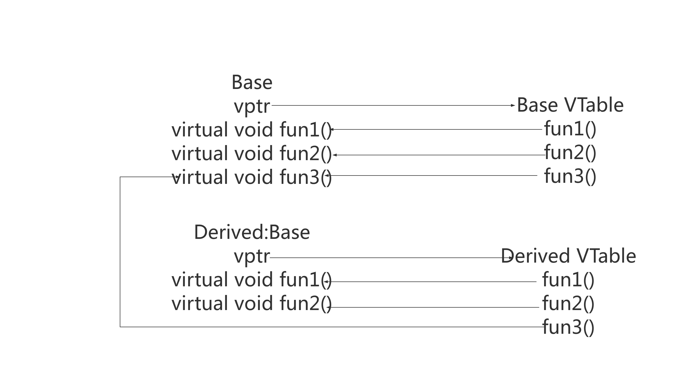

# 虚函数

---

## 1.虚函数简介

虚函数是实现多态行为的基础，多态性是 C++ 三大特点之一，多态主要有两种形式：静态多态（编译时多态）和动态多态（运行时多态）。其中动态多态主要通过虚函数和继承来实现。

虚函数：在基类中声明的函数，通过在声明前加 `virtual` ​关键字标记。派生类可以覆盖这些函数来提供特定于类的行为。当通过基类的指针或引用调用这个函数时，实际调用的是对象类型对应的派生类中的版本，这种机制称为**动态/后期绑定**。


## 2.虚函数实现原理

虚函数底层实现是通过虚函数表（vtable）实现的，**每个使用虚函数的类（或者从使用虚函数的类派生）都有自己的虚函数表**，虚函数表是编译器在编译时设置的静态数组（函数指针数组）。每个这样的类的对象中包含一个指向其虚函数表的指针（虚指针，vptr）。

当类的对象被创建时，编译器会在对象的内存布局中插入一个虚指针，该指针指向类的虚函数表。而虚函数表是按照类中虚函数声明的顺序来排列虚函数地址的。这个机制使得在存在继承关系的类的对象中，可以动态地调用正确的虚函数实现，提供了运行时多态性。

虚函数工作的底层流程：

1. **虚函数表的建立**：编译器为每个包含虚函数的类创建一个虚函数表。如果类含有继承而来的虚函数，那么这些函数的地址也会在新的虚函数表中，确保派生类的虚函数表包括从基类继承下来的所有虚函数。

2. **虚指针的初始化**：对象被创建时，编译器会在对象的内存布局中的开始位置设置一个虚指针。这个虚指针指向该对象所属类的虚函数表。

3. **多态调用时的解析**：当通过基类的指针或引用调用一个虚函数时，编译器产生的代码会根据该指针或引用实际指向对象的虚函数表去调用适合的函数实现。程序在运行时查看对象的虚指针，通过它找到虚函数表，再从表中得到要调用的虚函数的地址。

4. **派生类覆盖虚函数**：如果派生类提供了一个虚函数的新实现（即覆盖了虚函数），它的虚函数表中的相应项将被更新为新函数的地址（派生类虚函数替换基类虚函数）。这就是为何通过基类的指针或引用可以调用到派生类实现的原因。

   

## 3.实现与内部结构

调用图：



测试用例：

~~~C++
```c++
/**
 * @file virtual_function.cpp
 * @brief C++虚函数vptr和vtable
 * 编译：g++ -g -o vptr vptr1.cpp -std=c++11
 */

#include <iostream>
#include <stdio.h>
using namespace std;

/**
 * @brief 函数指针
 */
typedef void (*Fun)();

/**
 * @brief 基类
 */
class Base
{
public:
    Base(){};
    virtual void fun1()
    {
        cout << "Base::fun1()" << endl;
    }
    
    virtual void fun2()
    {
        cout << "Base::fun2()" << endl;
    }
    
    virtual void fun3(){}
    ~Base(){};
};

/**
 * @brief 派生类
 */
class Derived: public Base
{
public:
    Derived(){};
    void fun1()
    {
        cout << "Derived::fun1()" << endl;
    }

    void fun2()
    {
        cout << "DerivedClass::fun2()" << endl;
    }

    ~Derived(){};
};

/**
 * @brief 获取vptr地址与func地址,vptr指向的是一块内存，这块内存存放的是虚函数地址，这块内存就是我们所说的虚表
 *
 * @param obj
 * @param offset
 *
 * @return 
 */
Fun getAddr(void* obj,unsigned int offset)
{
    cout<<"======================="<<endl;
    void* vptr_addr = (void *)*(unsigned long *)obj;  //64位操作系统，占8字节，通过*(unsigned long *)obj取出前8字节，即vptr指针
    printf("vptr_addr:%p\n",vptr_addr);
    
    /**
     * @brief 通过vptr指针访问virtual table，因为虚表中每个元素(虚函数指针)在64位编译器下是8个字节，因此通过*(unsigned long *)vptr_addr取出前8字节，
     * 后面加上偏移量就是每个函数的地址！
     */
    void* func_addr = (void *)*((unsigned long *)vptr_addr+offset);
    printf("func_addr:%p\n",func_addr);
    return (Fun)func_addr;
}
int main(void)
{
    Base ptr;
    Derived d;
    Base *pt = new Derived(); // 基类指针指向派生类实例
    Base &pp = ptr; // 基类引用指向基类实例
    Base &p = d; // 基类引用指向派生类实例
    cout<<"基类对象直接调用"<<endl;
    ptr.fun1();
    cout<<"基类引用指向基类实例"<<endl;
    pp.fun1(); 
    cout<<"基类指针指向派生类实例并调用虚函数"<<endl;
    pt->fun1();
    cout<<"基类引用指向派生类实例并调用虚函数"<<endl;
    p.fun1();
    
    // 手动查找vptr 和 vtable
    Fun f1 = getAddr(pt, 0);
    (*f1)();
    Fun f2 = getAddr(pt, 1);
    (*f2)();
    delete pt;
    return 0;
}
```
~~~

运行结果：

~~~c++
```
基类对象直接调用
Base::fun1()
基类引用指向基类实例
Base::fun1()
基类指针指向派生类实例并调用虚函数
Derived::fun1()
基类引用指向派生类实例并调用虚函数
Derived::fun1()
=======================
vptr_addr:0x401130
func_addr:0x400ea8
Derived::fun1()
=======================
vptr_addr:0x401130
func_addr:0x400ed4
DerivedClass::fun2()
```
~~~

过程：

1. 程序识别出fun1()是个虚函数；

2. 程序使用**pt->vptr**来获取Derived的虚拟表；

3. 它查找Derived虚拟表中调用哪个版本的fun1()。这里就可以发现调用的是Derived::fun1()。因此**pt->fun1()**被解析为Derived::fun1()

   

## 4.虚函数中默认参数

**默认参数是静态绑定的，虚函数是动态绑定的，默认参数的使用需要看指针或者引用本身的类型，而不是对象的类型。**

代码：[default_argv.cpp](./default_argv.cpp)


## 5.纯虚函数和抽象类

纯虚函数：在基类中声明的虚函数，其本身提供的是一个接口约定，而不提供具体实现（通过 `= 0` 语法指定）。**拥有纯虚函数的类称为抽象类，抽象类不能被实例化。**派生类必须提供所有纯虚函数的实现才能被实例化。

```C++
// 抽象类
Class A {
public: 
    virtual void show() = 0; // 纯虚函数
    /* Other members */
};
```

**抽象类中，在成员函数内可以调用纯虚函数，在构造函数/析构函数内部不能使用纯虚函数。**

```C++
/**
 * @brief
 * 抽象类中：在成员函数内可以调用纯虚函数，在构造函数/析构函数内部不能使用纯虚函数
 * 如果一个类从抽象类派生而来，它必须实现了基类中的所有纯虚函数，才能成为非抽象类
 */

#include <iostream>
using namespace std;

class A {
public:
  virtual void f() = 0; // 纯虚函数
  void g() { this->f(); }
  A() {}
};
class B : public A {
public:
  void f() { cout << "B:f()" << endl; }
};
int main() {
  B b;
  b.g();
  return 0;
}
```

运行结果：

```C++
B:f()
```


## 6.虚函数注意事项

1. 重载和覆盖（重写）的区别
    
    重载：**静态多态**的一种形式，即在编译时发生。规则如下：
    
    * 有相同函数名，必须有不同的参数列表（参数数量、参数顺序和参数类型不同）
    * 重载可以发生在同一个类中或者在一个类的派生类中。
    * 重载关注点在于函数的参数列表，与函数的返回类型无关。
    * 调用重载的函数时，编译器根据函数调用时提供的参数类型来确定使用哪个函数。
    
    覆盖（重写）：**动态多态**的一种形式，既在运行时发生。规则如下：
    * 覆盖发生在派生类中，当派生类重新定义基类中的虚函数。
    
    * 被覆盖的函数必须有相同函数签名（函数名、参数列表以及返回类型）。
    
    覆盖目的在于让派生类能够改变或扩展继承的行为。调用覆盖的函数时，哪个函数被调用取决于对象的实际类型，运行时决定的。
    
    

2. C++11引入`override`​关键字来明确表示一个函数是显式覆盖基类中的虚函数，增加代码可读性和维护性。

   

3. 静态函数可以声明为虚函数吗？

    **静态函数不可以声明为虚函数，同事也不能被const和volatile关键字修饰**

    static成员函数不属于任何类的对象或者实例，只属于类，加virtual没意义

    虚函数是依靠vptr和vtable实现，vptr是通过this指针访问，静态成员函数没有this指针。

    

4. 构造函数和析构函数可以为虚函数吗？

    **构造函数不可以声明为虚函数。同时除了inline/explicit之外，构造函数不允许使用其他任何关键字**

    虚函数表vtable是在编译阶段就已经建立的，但指向虚函数表的指针vptr是在运行阶段实例化对象时才产生的。 如果类含有虚函数，编译器会在构造函数中添加代码来创建vptr。 问题来了，如果构造函数是虚的，那么它需要vptr来访问vtable，可这个时候vptr还没产生。 因此，构造函数不可以为虚函数。

    

    **析构函数可以声明为虚函数，如果我们需要删除一个指向派生类的基类指针时，应该把析构函数声明为虚函数。事实上，只要一个类有可能会被其它类所继承， 就应该声明虚析构函数(哪怕该析构函数不执行任何操作)。**

    当存在基类指针或引用指向派生类的对象时，基类的析构函数必须为虚函数，为了确保当通过基类指针删除这个对象时，能正确调用派生类的析构函数以释放对象的资源。这样可以防止资源泄漏。如果基类的析构函数不是虚的，那么在通过基类指针或引用删除派生类对象时，只会调用基类的析构函数。

    

    **当存在基类指针或引用指向派生类的对象时，基类的析构函数是虚函数，派生类的析构函数自动是虚函数，即使你在派生类的析构函数声明中没有显式地使用`virtual`​关键字。**

    

5. 虚函数可以为私有函数吗？

    虚函数可以被私有化，但访问权限的细节要注意。

    代码：[virtual_function_private.cpp](./virtual_function_private.cpp)、[virtual_function_private1.cpp](./virtual_function_private1.cpp)

    

6. 虚函数可以被inline吗？

    **虚函数可以是内联函数，但是当虚函数表现多态性的时候不能内联。**内联是编译器建议编译期内联，而虚函数的多态性在运行期，编译器无法知道运行期调用哪个代码，因此虚函数表现为多态性时（运行期）不能内联。

    

    `inline virtual`唯一可以内联的时候是：编译器知道所调用的对象是哪个类（如 `Base::who()`），这只有在编译器具有实际对象而不是对象的指针或引用时才会发生。

    

7. 成员函数

    当存在基类指针或引用指向派生类的对象时，派生类中不是必须覆写基类中的虚函数，不是强制的。

    

8. 如果基类中的虚函数是有纯虚函数，子类必须提供该虚函数的具体实现，否则子类也会变成抽象类，不能实例化对象。

    

## 6.测试用例

```c++
#include <iostream>
using namespace std;

// 基类
class Father{
public:
    Father(){
        cout << "Create Father." << endl;
    }
    
    // 虚函数
    virtual void draw(){
        cout << "draw Father." << endl;
    }

    // 虚析构函数
    virtual ~Father(){
        cout << "Father's destructor called." << endl;
    }
};

// Son 类，继承自Father
class Son1 : public Father{
public:
    Son1(){
        cout << "Create Son1." << endl;
    }
    
    void draw() override { // 覆盖 draw 方法
        cout << "draw son1." << endl;
    }

    ~Son1(){
        cout << "Son1's destructor called." << endl;
    }
};

// Son2 类，继承自Father
class Son2 : public Father{
public:
    Son2(){
        cout << "Create Son2." << endl;
    }

    ~Son2(){
        cout << "Son2's destructor called." << endl;
    }
};

void drawFather(Father father){
    father.draw(); // 多态调用
}

int main(){
    Son1 son1;
    Son2 son2;
    cout << "--1--" << endl;
    
    Father* father1 = &son1;
    Father& father2 = son2;
    
    // 使用引用来调用 draw，体现多态
    father1->draw();    //调用son1的成员函数draw()，已覆盖Father的虚函数
    cout << "--2--" << endl;
    father2.draw();     //调用Father的成员函数draw()，没有定义draw()函数
    cout << "--3--" << endl;
    
    //调用拷贝构造函数，没有调用构造函数，对派生类Son1、Son2的对象进行切片，只拷贝了类Father部分，派生类Son1、Son2特有部分被切掉了，多态没有发挥作用
    drawFather(son1);
    cout << "--4--" << endl;
    drawFather(son2);
    cout << "--5--" << endl;

    return 0;
}
```

打印结果：

```c++
Create Father.
Create Son1.
Create Father.
Create Son2.
--1--
draw son1.
--2--
draw Father.
--3--
draw Father.
Father's destructor called.
--4--
draw Father.
Father's destructor called.
--5--
Son2's destructor called.
Father's destructor called.
Son1's destructor called.
Father's destructor called.
```


‍
